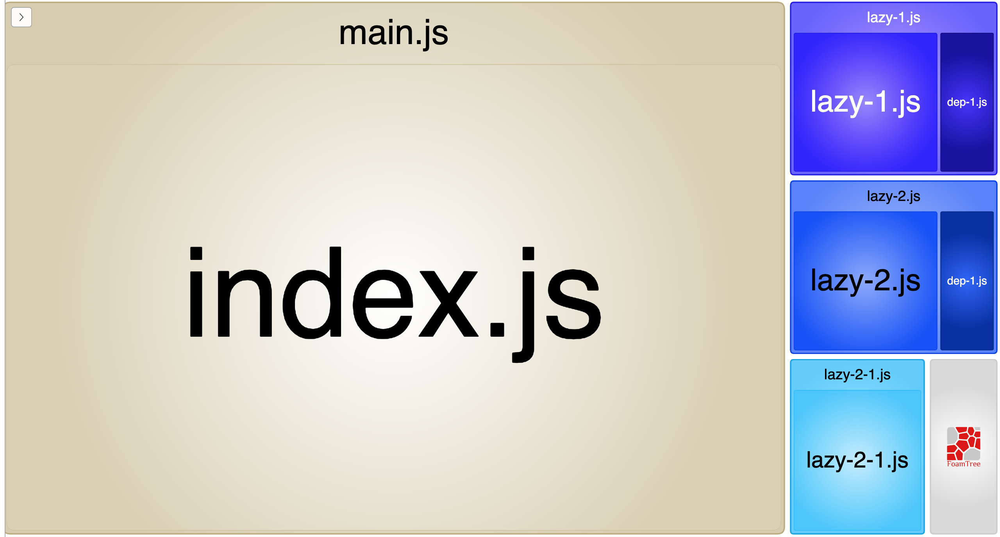
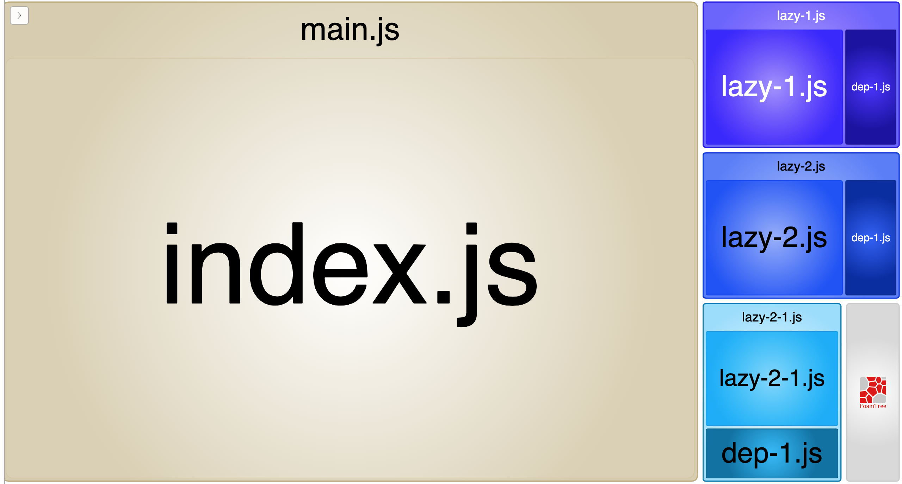

# dedupe-dependent-chunks-webpack-plugin

> Webpack plugin to dedupe modules from chunks known to load only after others with those modules.

[](https://copyhaste.com/c?t=npm%20add%20-D%20dedupe-dependent-chunks-webpack-plugin "npm add -D dedupe-dependent-chunks-webpack-plugin (copy)")

Suppose you have a part of your app whose code you lazy load with [Webpack dynamic imports](https://webpack.js.org/guides/code-splitting/#dynamic-imports),
or even [`react-loadable`](https://github.com/jamiebuilds/react-loadable).

That lazy-loaded page may itself may lazy load other code,
e.g., code below the fold or only needed on interactions.
This code might only be used on this page and nowhere else in the app.

Even if the lazy-loaded page chunk and its additional lazy-loaded chunks share some common modules,
Webpack may not understand that your UI guarantees that the latter will _only ever_ be loaded _after_ the former.

The `DedupeDependentChunksWebpackPlugin` lets you manually inform Webpack that it can remove shared modules
from any other lazy-loaded chunks that your lazy-loaded chunks might load.

If you specify only dependent chunks, we'll automagically determine all the dependee chunks
that import it, and only remove modules from the dependent that are common to all dependees.

Example `webpack.config.js`:

```js
const DedupeDependentChunksPlugin = require("dedupe-dependent-chunks-webpack-plugin");

module.exports = {
  entry: "./src/index.js",
  plugins: [new DedupeDependentChunksPlugin("lazy-2-1")],
  optimization: {
    splitChunks: {
      chunks: "all",
      name: true
    }
  }
};
```

Or, with multiple dependees:

```js
new DedupeDependentChunksPlugin(
  ["a-lazy-component", "another-lazy-component"] // dependees
);
```

Or, with explicit object of dependee-dependents mapping:

```js
new DedupeDependentChunksPlugin({
  "some-lazy-part": "a-lazy-component-of-its" // dependee: dependent
  // etc.
});
```

Or, with array of dependents:

```js
new DedupeDependentChunksPlugin({
  "some-lazy-part": ["a-lazy-component-of-its"] // dependee: dependents
  // etc.
});
```

Or, as array of pairs:

```js
new DedupeDependentChunksPlugin([
  ["some-lazy-part", "a-lazy-component-of-its"] // dependee, dependent
  // etc.
]);
```

Or, if you need to support multiple dependee chunks for a set of dependent chunks, as array of pairs of arrays:

```js
new DedupeDependentChunksPlugin([
  [
    ["some-lazy-part", "another-lazy-part"], // dependees
    ["a-lazy-component-of-theirs", "another-lazy-component-of-theirs"] // dependents
  ]
  // etc.
]);
```

---

See [`example`](./example) for an (admittedly trivial) example app.

With this plugin configured for the `lazy-2` chunk and dependent `lazy-2-1` chunk,
their shared `dep-1` module dependency is not included in `lazy-2-1` chunk:



Before:



(images from the [`webpack-bundle-analyzer`](https://github.com/webpack-contrib/webpack-bundle-analyzer))

---

Licensed by the [MIT License](./LICENSE).
